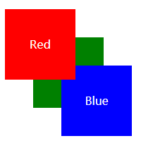

# z-index

最直观的感觉，z-index 越大的，层级越高，就会遮住下面的。这样子说并不准确，准确的是有效的 z-index，在同一个祖先层叠基础上进行比较时才会遵守这个规则。

## 规则说明

- z-index 只对定位了的元素才有效，要求元素的 position 不是 static，z-index 设置不是 auto。
- 对于没有设置 position 的元素，那它就是最基本的文档流，就是一个个的排列，元素间按照文档流的先后显示
- 对于设置了 position 的元素，此时可以通过改变 z-index 来改变层级了。
- 对于有效的 z-index，值越大，越在上面.前提是在一个基准上，专业点叫层叠上下文（对一个元素设置有效的 z-index 之后，这个元素就创建了新的层叠上下文，叫 stacking context）。如果两个元素设置同样的 z-index 值，那就按照先后顺序来显示，后出现的层级更高。
- 定位和没定位的元素在一块，定位了并且 z-index 为负值的在下面，然后是没定位的，再然后是定位的并且 z-index 为正值的。

```html
<div class="parent">
  <div class="child1 child"></div>
  <div class="child2 child"></div>
</div>

<style>
  .parent {
    position: relative;
  }
  .child {
    position: relative;
    width: 200px;
    height: 200px;
  }
</style>
```

```css
/* 默认下child1会在child2的下面*/
.child1 {
  background-color: red;
}
.child2 {
  background-color: blue;
  left: 20px;
  top: -50px;
}
```

```css
/* 
开启z-index之后，child1就会在child2上面. 此时仍然可以通过改变child2的z-index，让child2显示在child1的上面。如果child1和child2设置z-index为同一个值，那此时又根据二者在文档流里出现的先后顺序来排列。
 */
.child1 {
  background-color: red;
  z-index: 100;
}
.child2 {
  background-color: blue;
  left: 20px;
  top: -50px;
  /* z-index: 200; */
}
```

- 两个父容器，在他们里面的子元素设置了 z-index，那他们之间重叠时，二者的子元素是在父容器的层级基础上进行判断的.

```html
<div class="parent1">
  <div class="child1"></div>
</div>
<div class="parent2">
  <div class="child2"></div>
</div>
```

```css
.parent1,
.parent2 {
  height: 200px;
  position: relative;
}

.child1,
.child2 {
  height: 120px;
  position: relative;
}

.child1 {
  z-index: 100;
}

.child2 {
  z-index: 0;
}

.parent1 {
  z-index: 1;
}

.parent2 {
  z-index: 2;
}
```

将 4 个 div 调整 top、left 使他们相交，会发现，parent2 及其子元素都在 parent1 及其子元素之上。在比较时可以简单的将层级记作 1, 1.100, 2, 2.0。2 和 2.0 可不是一个值。

这里说的子元素在父容器基础上还不够准确，准确来说是在上一个**层叠上下文**基础上。看下面的例子：

```html
<div>
  <span class="red">Red</span>
</div>
<div>
  <span class="green">Green</span>
</div>
<div>
  <span class="blue">Blue</span>
</div>
```

```css
.red,
.green,
.blue {
  position: absolute;
  width: 100px;
  color: white;
  line-height: 100px;
  text-align: center;
}

.red {
  z-index: 1;
  top: 20px;
  left: 20px;
  background: red;
}

.green {
  top: 60px;
  left: 60px;
  background: green;
}

.blue {
  top: 100px;
  left: 100px;
  background: blue;
}
```

结果如下：


如果只是认为在父容器的层级基础上继续算自己的层级，那父容器按照文档流的先后，后面的要比前面的高，但结果并不是这样。红色的创建了新的层叠上下文，而绿色和蓝色并没有新的上下文，他们的上下文的基准值都是整个 html，所以相当于 1，0，0，而蓝色比绿色在后，所以蓝色又在绿色之上。此时设置绿色和蓝色的 z-index，就可以调整 3 者的层级关系。但如果给他们的父 div 设置 z-index 之后，他们的基准上下文就不再是 html 了，而是各自的 div。（要注意，z-index 必须 position 设置定位值，不然无效。）此时他们的层级关系就要先算各自的基准了。

- 对元素设置有效的 position 和 z-index 会创建新的层叠上下文，这是最常见的方式，还有其它的方式，比如设置 opacity 为小于 1 的值也可以 😂😂😂。
- 网页的根元素<html>会自动创建一个。这也是显然的，总归要有个嘛

## 问题

- 会不会设置其它的属性也会生成新的 stacking context 呢？

## links

- https://philipwalton.com/articles/what-no-one-told-you-about-z-index/
- https://developer.mozilla.org/zh-CN/docs/Web/Guide/CSS/Understanding_z_index
- https://www.w3.org/TR/CSS2/zindex.html
