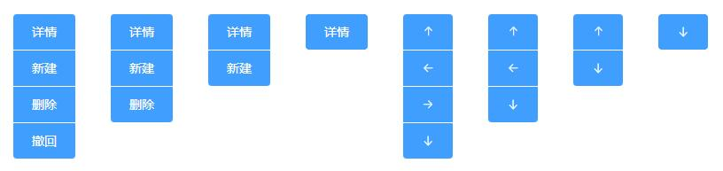

# Button

使用`button`标签封装的，重点在 scss 的写法上，功能上并不复杂。

`button-group`是对`button`的封装，使用`slot`，终点在对内部的`el-button`进行样式的改变

下面是竖行的简单封装



```js
<template>
  <div>
    <div class="button-group">
      <el-button type="primary">详情</el-button>
      <el-button type="primary">新建</el-button>
      <el-button type="primary">删除</el-button>
      <el-button type="primary">撤回</el-button>
    </div>
    <div class="button-group">
      <el-button type="primary">详情</el-button>
      <el-button type="primary">新建</el-button>
      <el-button type="primary">删除</el-button>
    </div>
    <div class="button-group">
      <el-button type="primary">详情</el-button>
      <el-button type="primary">新建</el-button>
    </div>
    <div class="button-group">
      <el-button type="primary">详情</el-button>
    </div>

    <div class="button-group">
      <el-button type="primary" icon="el-icon-top"></el-button>
      <el-button type="primary" icon="el-icon-back"></el-button>
      <el-button type="primary" icon="el-icon-right"></el-button>
      <el-button type="primary" icon="el-icon-bottom"></el-button>
    </div>

    <div class="button-group">
      <el-button type="primary" icon="el-icon-top"></el-button>
      <el-button type="primary" icon="el-icon-back"></el-button>
      <el-button type="primary" icon="el-icon-bottom"></el-button>
    </div>

    <div class="button-group">
      <el-button type="primary" icon="el-icon-top"></el-button>
      <el-button type="primary" icon="el-icon-bottom"></el-button>
    </div>

    <div class="button-group">
      <el-button type="primary" icon="el-icon-bottom"></el-button>
    </div>
  </div>
</template>

<script>
  export default {}
</script>

<style lang="scss">
  $button-group-item-border-radius: 4px;
  .button-group {
    padding: 20px;
    background: white;
    display: inline-flex;
    flex-direction: column;

    & > .el-button {
      display: block;
      border-radius: $button-group-item-border-radius;

      & + .el-button {
        margin: 0;
      }

      &:not(:last-child) {
        margin-bottom: 1px;
      }

      &:first-child:not(:last-child) {
        border-top-left-radius: $button-group-item-border-radius;
        border-top-right-radius: $button-group-item-border-radius;
        border-bottom-left-radius: 0;
        border-bottom-right-radius: 0;
      }

      &:last-child:not(:first-child) {
        border-top-left-radius: 0;
        border-top-right-radius: 0;
        border-bottom-left-radius: $button-group-item-border-radius;
        border-bottom-right-radius: $button-group-item-border-radius;
      }

      &:not(:first-child):not(:last-child) {
        border-radius: 0;
      }

      // &:first-child:last-child {
      //   padding-left: 12px;
      //   padding-right: 12px;
      //   border-radius: 50%;
      // }
    }
  }
</style>
```
