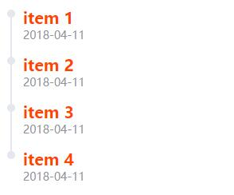

# TimeLine

下面是一个极简的实现，总体上是这么做的,主要就是如何布局和样式,完整功能在此基础上扩展。Element 里分为`el-timeline`和`el-timeline-item`,还用 jsx 的语法写 vue 的代码



```js
<template>
  <div style="padding: 20px;">
    <ul class="time-line-wrapper">
      <li
        v-for="item in items"
        :key="item.id"
        class="time-line-item"
      >
        <div class="time-line-item-node"></div>
        <div class="time-line-item-tail"></div>
        <div class="time-line-item-content">
          <p class="time-line-item-content-label">{{item.label}}</p>
          <p class="time-line-item-content-time">2018-04-11</p>
        </div>
      </li>
    </ul>
  </div>
</template>

<script>
export default {
  data() {
    return {
      items: [
        {
          id: 1,
          label: "item 1"
        },
        {
          id: 2,
          label: "item 2"
        },
        {
          id: 3,
          label: "item 3"
        },
        {
          id: 4,
          label: "item 4"
        }
      ]
    };
  }
};
</script>

<style lang="scss">
.time-line-wrapper {
  list-style: none;

  .time-line-item {
    padding-bottom: 20px;
    box-sizing: border-box;
    position: relative;

    .time-line-item-node {
      width: 10px;
      height: 10px;
      border-radius: 50%;
      box-sizing: border-box;
      background: #e4e7ed;
      position: absolute;
    }

    .time-line-item-tail {
      width: 2px;
      height: 100%;
      background: #e4e7ed;
      box-sizing: border-box;
      position: absolute;
      transform: translateX(4px);
    }

    .time-line-item-content {
      margin-left: 10px;
      padding-left: 10px;
      padding-right: 10px;
      line-height: 1;

      .time-line-item-content-label {
        font-size: 20px;
        color: #ff4400;
        font-weight: bold;
      }

      .time-line-item-content-time {
        font-size: 14px;
        color: #909399;
        padding-top: 5px;
      }
    }

    &:last-child {
      .time-line-item-tail {
        display: none;
      }
    }
  }
}
</style>
```
