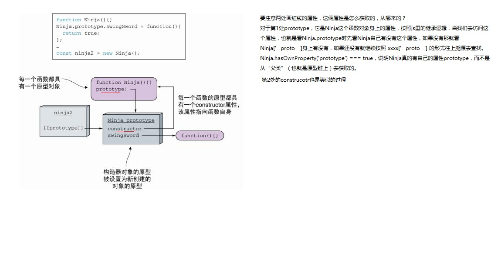
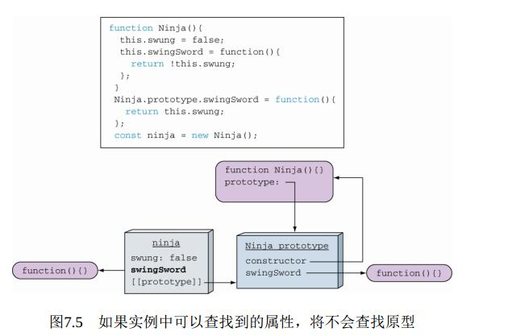
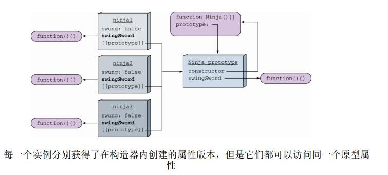
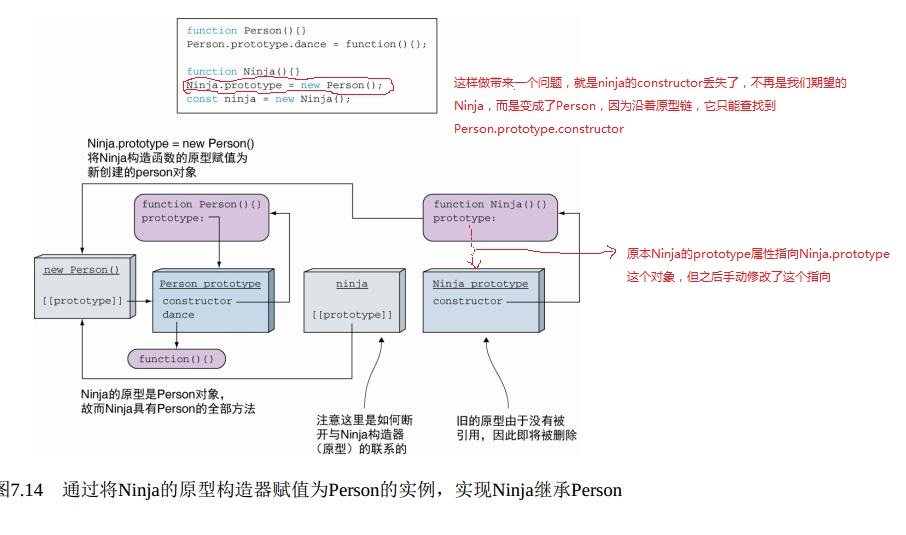
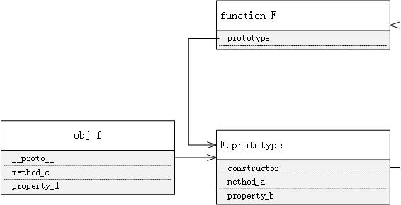
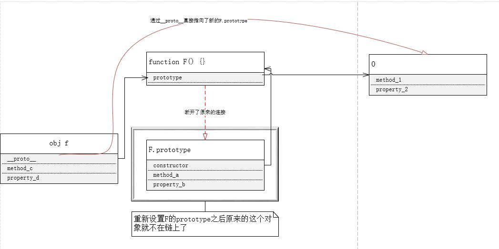

## 原型

> 测试文件在 [example02](../src/example02.html)

最简单的代码:类比其他语言，实例对象 `ninja` 是通过 `new xxx()` 这种方式获取的，我们称 `Ninja` 是实例 `ninja` 的**类**，这只是一种类比得到的概念，并不准确，但好理解

```js
function Ninja(name) {
  this.name = name || "";
}

Ninja.prototype.swingSword = function() {
  // do something
  console.log("swing sword");
};

var ninja = new Ninja("m");
```



上图表示的是最简单的代码的内部示意图。



在构造函数里，给生成的实例对象绑定了新的属性方法 swingSword，而在整个的原型链上也有个 swingSword 方法，在访问的时候就会屏蔽上层的方法和属性。但如果像下图那样创建很多实例的话，那每个实例都有一份自己的方法，而这些方法却执行同样的逻辑，那就造成了内存的浪费





### instanceof

下面的代码结果如何呢？

```js
ninja instanceof Ninja;
ninja instanceof Person;
```

答案是两个都是`true`。为啥？这要看`instanceof`的作用

> The instanceof operator tests whether the prototype property of a constructor appears anywhere in the prototype chain of an object.

`instanceof` 就是检测实例对象的构造函数的 `prototype` 属性是否出现在对象的原型链上。这就解释了为啥下面的代码里一个是 true ，一个是 false。因为第一个时 Ninja.prototype 是在 ninja 的原型链上的，而之后修改了 Ninja.prototype 的指向，ninja 仍然链接到的是之前的那个 Ninja.prototype，跟现在的不是一个，所以现在的 Ninja.prototype 并不在 ninja 的原型链上，所以结果是 false

```js

funciton Ninja() {}

var ninja = new Ninja()

console.log(ninja instanceof Ninja)  // true

Ninja.prototype = {}

console.log(ninja instanceof Ninja) // false

```

来个完整的图，看下结构:[javascript object layout](http://www.mollypages.org/tutorials/js.mp)


```js
function A(foo) {
  this.foo = foo;
}
var a = new A("a");
var b = Object.create(a);
```

上面的实际结果只是完成了一种关系的连接，`b.__proto__ === a`,按照 a 的模子去创建了 b，但是这种方式不会调用构造函数 A，所以创建的 b 会丢失一部分东西。

下面是 MDN 提供的一种简易的 Object.create 的 pollyfill。最关键的就是那3行。为啥这可以作为pollyfill呢？

```js
if (typeof Object.create !== "function") {
  Object.create = function(proto, propertiesObject) {
    if (typeof proto !== "object" && typeof proto !== "function") {
      throw new TypeError("Object prototype may only be an Object: " + proto);
    } else if (proto === null) {
      throw new Error(
        "This browser's implementation of Object.create is a shim and doesn't support 'null' as the first argument."
      );
    }

    if (typeof propertiesObject != "undefined")
      throw new Error(
        "This browser's implementation of Object.create is a shim and doesn't support a second argument."
      );

    function F() {}
    F.prototype = proto;

    return new F();
  };
}
```

通过两张图比较:上图是原来的结构，下图是改写后的结构




- 所有的函数 `function` 都有 `prototype` 这个属性，只不过不是每个 `function` 的 `prototype` 都那么有用，只有用来实现继承的那些 `function` 的 `prototype` 才有意义。比如在上面的代码中，`Ninja.prototype.swingSword`是个 `function`，它本身也有 `prototype` 属性，但对我们实际使用来说没有意义，因为我们就是让它执行段操作（打印一句话），跟其他无关，并不关注它是否有个“继承链”，但如果涉及到继承体系了，那就很有用了。

> 其实并不是每个函数都有 prototype 属性，通过 Function.prototype 上的 bind 方法得来的函数就没有这个属性。这一点是 js 的[规范](http://www.ecma-international.org/ecma-262/6.0/)里明确写明的，详见 19.2.3.2 Function.prototype.bind ( thisArg , ...args)

- 每个对象都有一个`constructor`属性，它表示创建这个对象的函数。`ninja.constructor`就不说了，很常见也很容易理解。`Ninja`是一个函数（function），它也是个对象，它可以看作 `Function` 的一个实例对象，访问 `Ninja.constructor`就是从它的原型 `Function.prototype`去访问`constructor`属性，所以`Ninja.constructor === Function.prototype.constructor === Function`
- 每个“物体”(Ninja, ninja, Array, String, 1, true)都可以看作一个对象（其实不是看作，而是就是对象，在 js 里都是对象,一切都要看作对象，`ninja` 是对象，`Ninja` 也是对象，甚至数字`1`也是对象），每个对象都有一个私有属性 `__proto__`，这个属性是不能正式使用的，它指向对象的构造函数的原型对象，`ninja.__proto__ ==> Ninja.prototype`
- 访问一个对象 `obj` 的某个属性或者方法，如果它自己本身没有，那就会去查找`obj['__proto__']`指向的那个对象有没有。如果有就用，如果没有就会继续查找`obj['__proto__']['__proto__']`指向的那个对象上有没有，一直到最后访问到`null`上。如果是设置属性,那就会不一样,下面的例子中，第一次访问 `foo.name`，是先看 `foo` 上有没有这个属性，发现没有，然后就去找原型 `Foo.prototype` ,发现有那就用。然后通过`foo.name`修改属性的值，这时候是在 `foo` 这个实例上创建了一个全新的 `name` 属性，之后再设置 `name` 的属性值，已经跟原型上 `name` 属性隔离开了，所以 `Foo.prototype.name` 没有发生改变

```js
function Foo() {}

Foo.prototype.foo = "foo";

var foo = new Foo();

console.log(foo.name, Foo.prototype.foo); // foo foo

foo.name = "bar";

console.log(foo.name, Foo.prototype.foo); // bar foo
```

- 如果访问`ninja.constructor`，那其实是从 Ninja.prototype 上找到了这个`constructor`属性，然后访问这个属性的。那么如果`ninja.constructor = function() { // xxxxx }`会修改`Ninja.prototype.constructor`吗？并不会，`ninja.constructor` 这种方式只是在`ninja`这个对象上添加了一个属于它自己的叫`constructor`的属性，与原型链上的`constructor`已经脱离关系了。这时候`new Ninja()`仍然按照之前的方法来创建新的实例。
- 上面的函数 `Foo` 不光是个函数，同时也是个对象。它是构造函数 `Function` 的一个实例，跟 `ninja` 是构造函数 `Ninja` 的一个实例一样。其实它的写法应该是 `var Foo = new Function(...args)`，这样就很明显看出来了。

```js
var a = {
  bar: "bar",
  foo: function() {
    // do something
  }
};
var b = {
  bar: "bar",
  foo: function() {
    // do something
  }
};
```

上面的代码中，对象 a 和 b 是属性和功能一致的两个对象，但是 a.bar 和 b.bar 自身有值，那就要在内存中去存这些值，内存不会因为两个 bar 的值是一样的就合并使用。函数 foo 也是个对象，它本身也要存在内存里，所以 a 和 b 又存了两份一样的 foo 函数。所以有必要实现继承，让 a 和 b 都遵循同一套模板而来，尽量复用能复用的函数和属性。

- new xxx()的过程实际上做了些什么？

```js
var foo = new Foo();
// ^^^^^^^^^^^^^^
var foo = new Object();
foo["__proto__"] = Foo.prototype;
Foo.call(foo);
```

```js
Object.__proto__ === Function.prototype; // true
Object.prototype.__proto__; // null
```

**Object 的原型是 null** 的正确理解是 `Object.prototype.__proto__ === null`,而不是 `Object.__proto__`

#### 参考链接

1. [JavaScript Inheritance and the Prototype Chain](https://tylermcginnis.com/javascript-inheritance-and-the-prototype-chain/)

2. [彻底理解原型链](https://www.cnblogs.com/wilber2013/p/4924309.html) 文章里有些地方也有错误

3. [Javascript – How Prototypal Inheritance really works](http://blog.vjeux.com/2011/javascript/how-prototypal-inheritance-really-works.html)

4. [js 秘密花园](http://bonsaiden.github.io/JavaScript-Garden/zh/)

5. [javascript object layout](http://www.mollypages.org/tutorials/js.mp)

6. [instanceof 的机制](https://www.ibm.com/developerworks/cn/web/1306_jiangjj_jsinstanceof/index.html)
