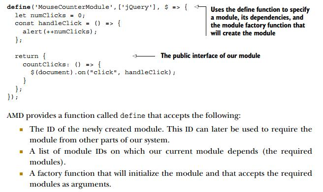
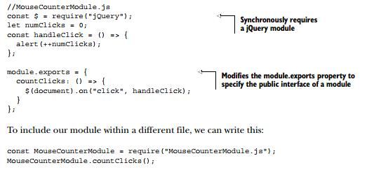

### 原始的模块化代码

比如 JQuery，整体上使用立即执行函数，创建新的作用域，添加属性到全局那种。

### AMD ( Asynchronous Module Definition)

指的是一种为浏览器端 js 模块化设定的规则，而不是具体指一种实现方式。AMD 的最广泛实现是 RequireJS。

AMD 实现方式最明显的是有个`define`方法，用来声明一个新的模块。例子中新的模块依赖 JQuery，所以浏览器会先去判断是否已经有了 JQuery 这个模块，如果没有就会去服务器加载。但这个**加载的过程是异步**的，浏览器并不会在这里阻塞掉，而是等加载完成之后，解析并执行了 JQuery 之后，再回调这里新写的模块代码。

### CommonJS

是一种为通用 js 环境设定的规则和实现，最广泛的使用是在 Node.js 里，它是基于文件的，一个文件就是一个模块，所以不能把不同模块的代码写在一个文件里。每个模块会对外公开一个 module 变量，module 有一个 exports 属性，我们通过在 exports 添加新的属性或者方法来扩展这个模块。module.exports 这个属性的值就是这个模块最后对外公开的“接口”。

CommonJS 采用同步加载方式，所以更适合在服务器端使用。因为在服务器端，只涉及到本地的服务器的文件系统加载，所需时间和代价都很小。而在浏览器端使用，文件需要从远端的服务器下载，会消耗更多时间，而且同步加载会造成浏览器阻塞。正因为如此，所以 CommonJS 不能直接使用到浏览器端，会造成很大的性能灾难，必须将其转化成浏览器可以识别的方式，这就需要用到 Browserify 或者 RequireJS

### UMD

AMD 和 CommonJS 采用完全不同的方式和规则都去实现了模块化组织 js 代码的功能，分属两大阵营，但如果一方想用另一方的东西，那就完蛋，所以催生了一个中间桥梁 UMD

### ES6 Module

上面的模块化各有千秋，ES6 规范里对这些规则和实现方式进行了统一，写法上跟 CommonJS 很类似，也是基于文件的。同时又像 AMD 那样支持异步加载。它的标志是 export 和 import。这个模块体系不能被浏览器直接使用，厂商们还没及时跟进，所以要对这种模块化的代码进行转化，最典型的就是 Babel
