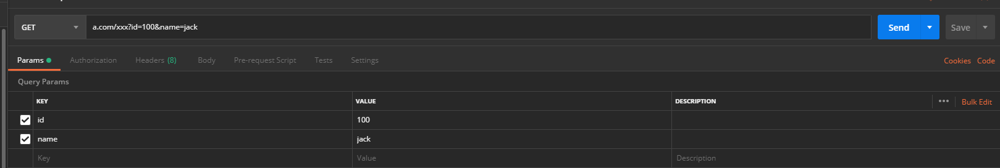
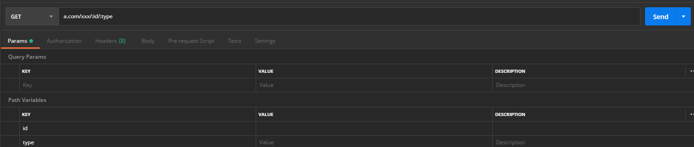
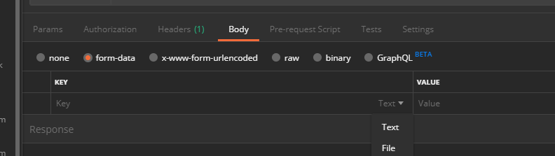

# postman 最基础使用

一般就用来测试 get 和 post 两种接口方式。

- query 的方式

例如：`http://www.xxxx.com/xxx?id=100&type=2`。 这种在 Params 里面直接写 key 和 value 就行，会自动的补充到 url 那里。在 url 直接写上也是可以的

还有种 path 写路径的方式，不过用的比较少:`http：//www.xxx.com/xxx/:id/:type`。这种要按照这个 url 在框里写上，然后就在 Params 里面自动出来 Path Params 了，然后填上参数就行了

- 如果要用 body 来发送数据给后台，通常用 post 方法。

  1. form-data 格式，Form 表单提交（要真的是 Form 自己的提交才行，并且设置 `enctype` 是 `multipart/form-data`）用这种方式或者自己构建 FormData 对象提交。可以设置 key-value 对，默认是文本数据，也可以选择成 file 文件。

  

  2. `x-www-form-urlencoded` 是表单提交的另一种格式，也是默认方式，全称是 `application/x-www-form-urlencoded`，这种方式会对要传递的数据先进行一次 url encode，然后在传递，有点类似 get 方式传递 query 时可以先对参数进行 url encode。这种方式只适合简单的 form 数据提交，不能对文件数据进行编码，所以不能上传文件。

  上面两种方式都可以提交表单数据，但有用法上的差异。所以要在使用时问清后台到底要传什么方式

  3. 选择 raw 之后，在右侧会出现下拉框，选择数据格式。然后是手动写。raw 不能传文件。

  4. binary 就是二进制数据，选择这个只能上传文件。

项目里传参数最多的情况

1. `get` 方法，在 query 里传，这样就写好 key 和 value 就行了
2. `post` 方法，最常见的是以 json 格式传递，这种就选择 raw，然后选择 json。如果是上传文件的，最常见的是选择 form-data，
3. `x-www-form-urlencoded` 一般不太都会用，这种不能传递文件，只能传递表单数据。而传简单的表单数据一般用 json 格式传。
