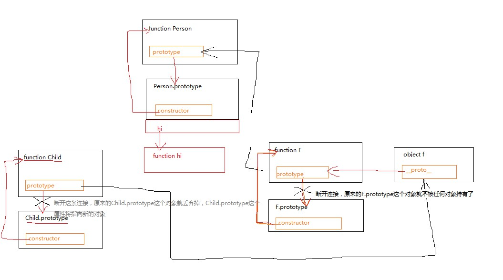
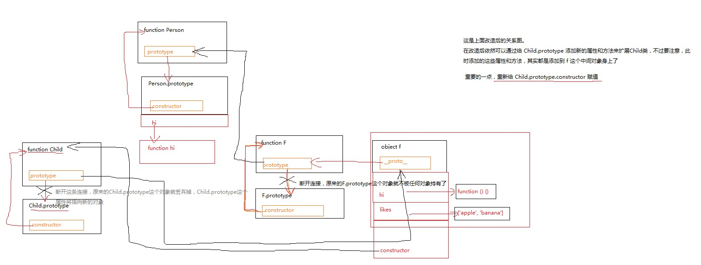

## 继承

js 中的继承就是让子类的对象拥有父类的属性和方法，所以最终的目的就是沿着原型链能查找到这些属性和方法就行，之间经过哪些步骤，是否会耗费别的东西，并不在意。

```js
function Foo() {
  this.foo = "foo";
}

Foo.prototype.foz = function() {
  console.log("Foo foz");
};

Foo.prototype.barz = "Foo barz";

Foo.prototype.likes = [1, 2];

function Bar() {
  // ...
}

Bar.prototype = new Foo();
Bar.prototype.constructor = Bar; // 不能丢失构造函数

var b = new Bar();
b.likes = ["a", "b"];
// b.likes.push(3)
var c = new Bar();
```

最简单的继承方式，是给“子类”的“构造函数”的 prototype 赋值一个“父类”的实例对象。

但这样子有几个问题：

“父类”的属性在子类中共享，如果一个子类的实例修改了这个属性，那就导致所有的实例的属性都会变。像 Foo 中的 likes，在 b 实例中使用 push 方法，就修改了最原始的那个数组，导致所有的都变了，而重新给 likes 赋值，只是在 b 这个实例上创建了一个新的实例属性 likes，该属性屏蔽掉了上层的属性的访问

很明显的，在给 Bar.prototype 赋值后，实例化 Bar 并不能调用 Foo 的构造函数，那 function Foo 里的初始化方法就不能完成，那这些实例其实都没啥意义的

```js
function Foo(name) {
  this.name = name || "foo";
}
//...
//...
function Bar(name) {
  Foo.call(this, name);

  // ...
}

Bar.prototype = new Foo();
Bar.prototype.constructor = Bar;
```

为了能让子类调用父类的构造函数并传参，可以在子类的构造函数里调用 function Foo，并且传入参数。这是一种很常见的继承方式。

但这种方式很明显，function Foo 被执行了两遍，可以将其减少掉 1 遍,只在调用 Bar 构造函数的时候调用 1 次。

原型链继承的核心是将父类的实例对象作为子类的原型。

```js
function Father() {}

Father.prototype.hi = function() {
  console.log("father hi");
};

function Child() {
  Father.call(this);
  this.type = "child";
}

function F() {}
F.prototype = Father.prototype;

var f = new F();

Child.prototype = f;
// console.log(Child.prototype.constructor === Father);
Child.prototype.constructor = Child; // 我们是用 new Child()的形式实例化的，理所当然的希望实例的构造函数是Child

Child.prototype.eat = function() {
  console.log("child eat");
};

var c = new Child();
console.log(c);
c.hi();
c.eat();
```

画图看关系，Child 能访问到 Father.prototype 上的所有属性和方法，同时在调用构造函数 Child 时，又执行了 Father 的构造函数，构造函数里的属性和方法也初始化好了，所以整条链上的所有的属性和方法 Child 的实例都能访问到，也就是完成了继承。




ES6 中的 class 继承是最直观的写法